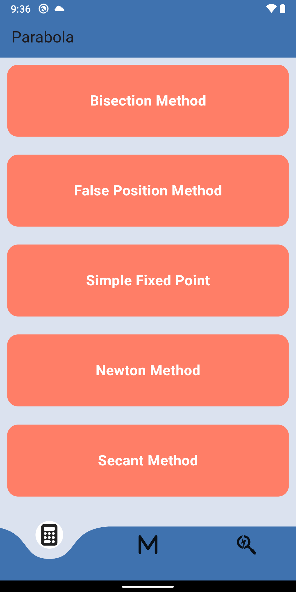
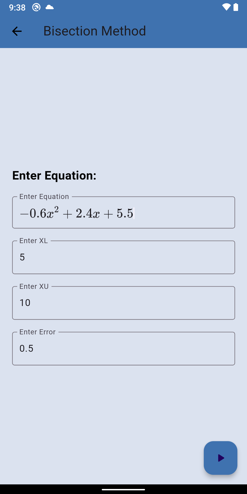
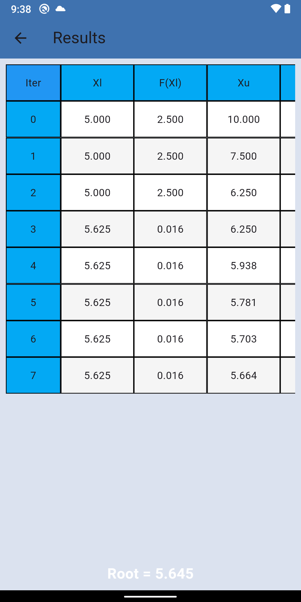
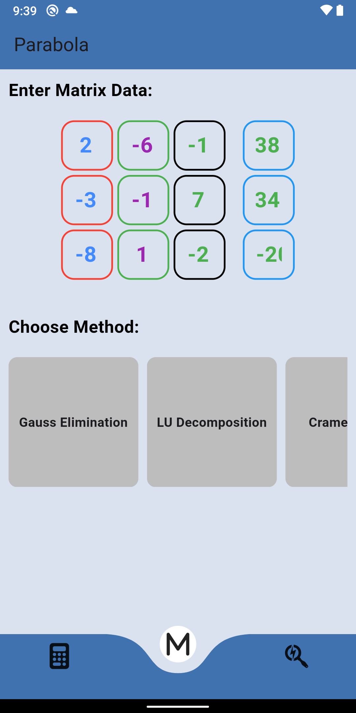
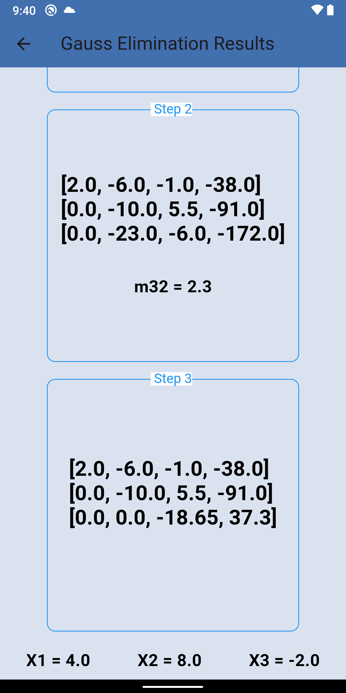

# Parabola


**Parabola** is a Flutter application created during my third year at university. It was one of my first projects in Flutter, and I developed it to implement various mathematical functions commonly taught in numerical analysis courses. The app offers solutions for different methods used in solving numerical problems, making it a handy tool for students studying these concepts.


## Features

The app implements the following methods:

- **Bisection Method**
- **False Position Method**
- **Simple Fixed Point Iteration**
- **Newton's Method**
- **Secant Method**
- **Gauss Elimination**
- **LU Decomposition**
- **Cramer's Rule**
- **Gauss-Jordan Elimination**
- **Partial Pivoting**
- **Golden Section Search**
- **Gradient Method**

These methods are all used to solve numerical analysis problems, making it a useful educational tool for anyone studying the subject.

## Key Details

- **State Management**: The app does not use any state management techniques, as this was one of my first Flutter projects.
- **UI**: The user interface is basic and not over-the-top, as I focused more on functionality than design at the time.
- **Code Quality**: As a beginner project, the code is not as clean as it could be. It's a reflection of my learning process and an early attempt at using Flutter.

## Installation

To run the app on your local machine, follow these steps:

1. Clone this repository:
   ```bash
   git clone https://github.com/Afwra/numerical_analysis_calculator.git

2. Navigate to project directory:
   ```bash
   cd parabola

3. Install the dependencies:
   ```bash
   flutter pub get

3. Run the app on an emulator or connected device:
   ```bash
   flutter run


## Screenshots
<div style="display: flex; flex-wrap: wrap; gap: 10px;">






</div>

## Contributing

Since this app was a personal project, there are no active plans for further development. However, if you want to improve the app, feel free to fork the project and submit pull requests with enhancements, bug fixes, or better UI/UX design!

## License

This project is open-source and available under the [MIT License](LICENSE). See the file for more details.


